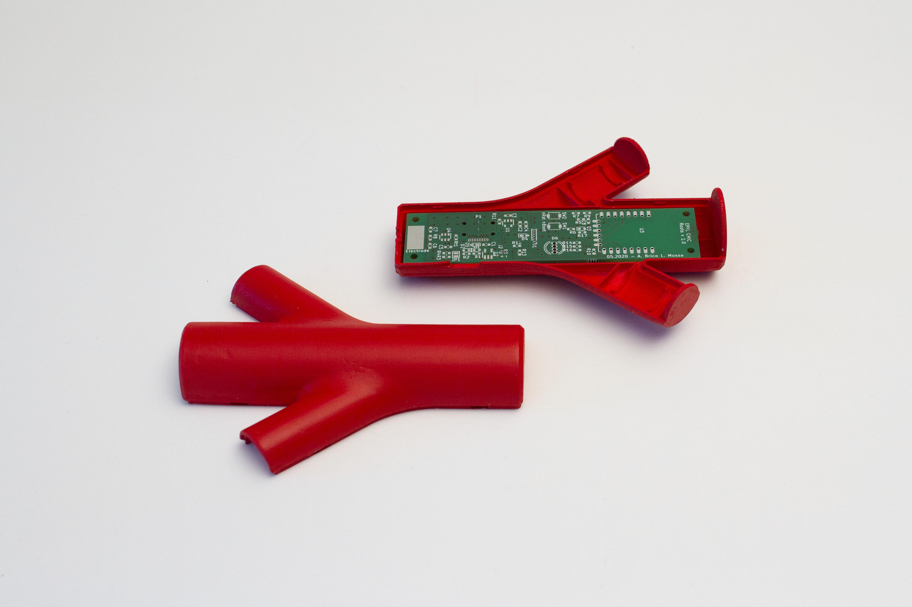
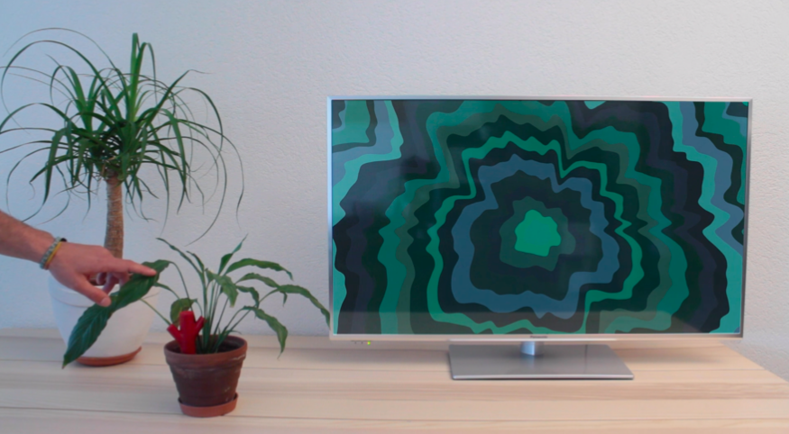
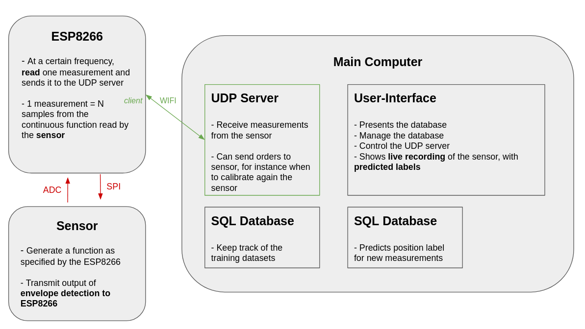
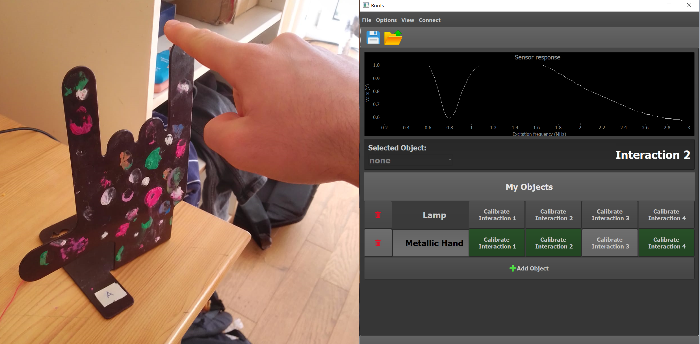
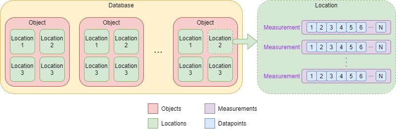
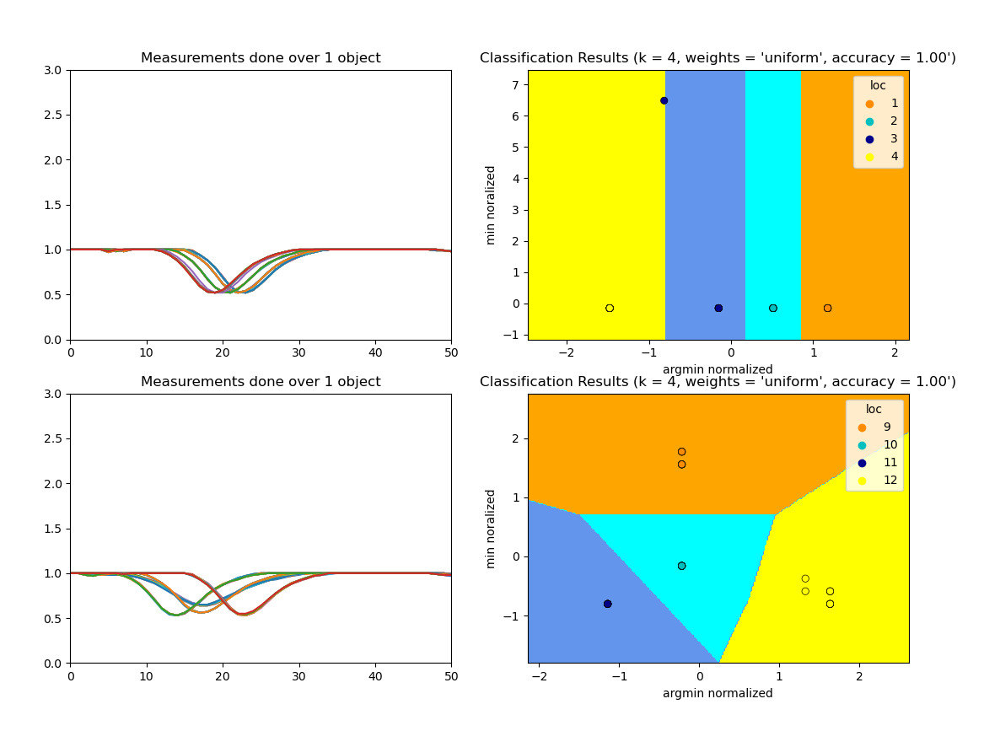

# Roots

> Arthur Bricq, Leonardo Mussa

**Roots** is a smart connected **touch sensor**, which can transform any conductive object into a remote controller for many possible applications. This project was first developed to work with **plants**, however it can really work well with any object. The technology that we have designed is ready to be set in your house. 

We provide in this repository several examples of code, including

- the schematics of the sensors.
- a user interface to connect to the smart sensors and use the technologies all in one place. 
- an API allowing machine learning classification using the data from the realized sensor.
- an API allowing the handling of a sqlite3 database to collect a training dataset
- the 3D model of the printable box [TODO]

## Initial Project, the roots of Roots

Those pictures illustrate the initial direction of the project: a smart sensor for generating artistic visual when interacting with plants. The code to perform this visual art generation is provided. 

This is done via **Processing**, here is the [code](processing/chic_1.pde).

## Extension of the project: a smart touch sensor

We developed our own touch sensor, which when working in pair with a **machine learning classifier** can detect when and how an object is touched. 

The schematics of the sensor are accessible [here](schematics/schematics_sensor.png), and it works in pair with a [main PCB](schematics/schematics_main_board.pdf) which has a **wifi module** to connect to any computer with **Python** installed.

This image illustrates the software that we created during the extension phase of the project. 

### User Interface

A user interface was programmed using QT. Code is accessible [here](src/main.py). One of the **thread** of the code is handling the **UDP** server, which allows communication with the sensor. 

Here is an example of what the User-Interface looks like. 

### Database API

The Python API that we developed to interact with the **sqlite3** database is accessible [here](src/database_gestion.py). 

Here is an illustration of the database.

### Machine Learning Classifier API

We designed a classifier accessible via this [API](src/classifier.py).

Here are classification results obtained with it.

### ESP8266

The microcontroller that we decided to work with is the **ESP8266** from Espressif. The reason is that it comes with a wifi module and it is really cheap (5$ on digikey). The code is accessible [here](esp8266/ESP8266_communication.ino) and was made available to be used within the **Arduino** framework. 

